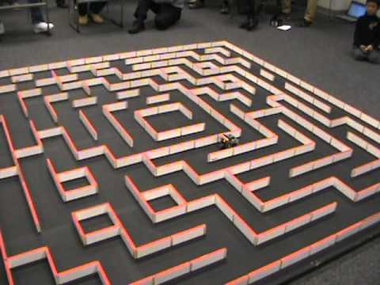

% La serpiente y el ratón :snake: :mouse:
% Clara Casas Castedo & Miguel Sánchez de León Peque
% 2017-11-23

El ratón :mouse:
================

Micromouse
----------

OSHWDem
-------

El resultado
------------

<video src="./videos/bulebule_camera_onboard.mp4" controls muted>
</video>

Bulebule
--------

Tecnologías
-----------

- **Lenguaje C** - libopencm3, gcc, clang format
- **Integración continua** - github, travis
- **Documentación** - doxygen, sphinx
- Y por supuesto... **¡¡Python!!**

La serpiente :snake:
====================

Calibración de sensores
-----------------------

Bluetooth
----------

Perfiles de velocidad
---------------------

Diseño de piezas 3D
-------------------

Simulación
----------

¡Eso es todo!
=============

Fuentes
-------

- Código: [github.com/Theseus](https://github.com/Theseus)
- Esquemáticos: [upverter/Theseus](https://upverter.com/Peque/3d82ffa66d538f81/Theseus/)

¿Preguntas?
-----------
